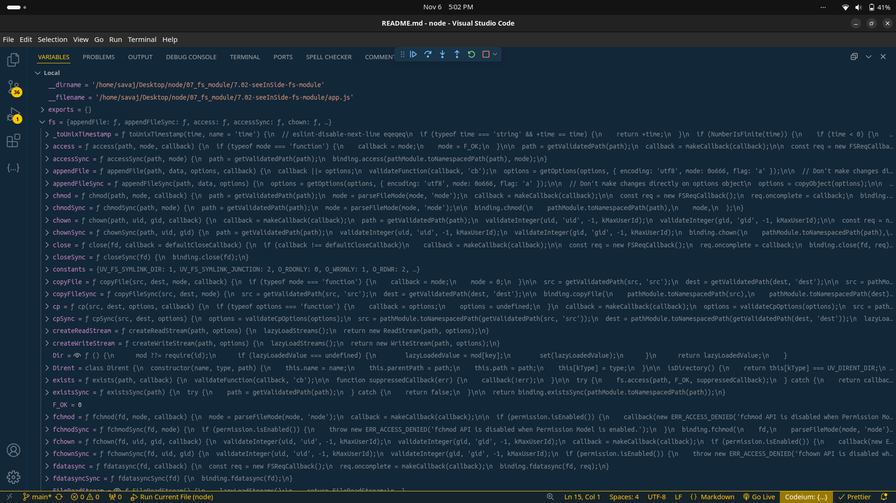

## see in side fs module.

- first create app.js file and write below code.

```JS
const fs = require('node:fs');

console.log(fs);
```

- now set debugger to console.

- and Run and Debugger using ctrl+f5

- below image is debug variable in side fs module....



`Note :`

see access and accessSync, appendFile and appendFileSync this type of two pare.

`in last sync keyword method are block main thread.`
