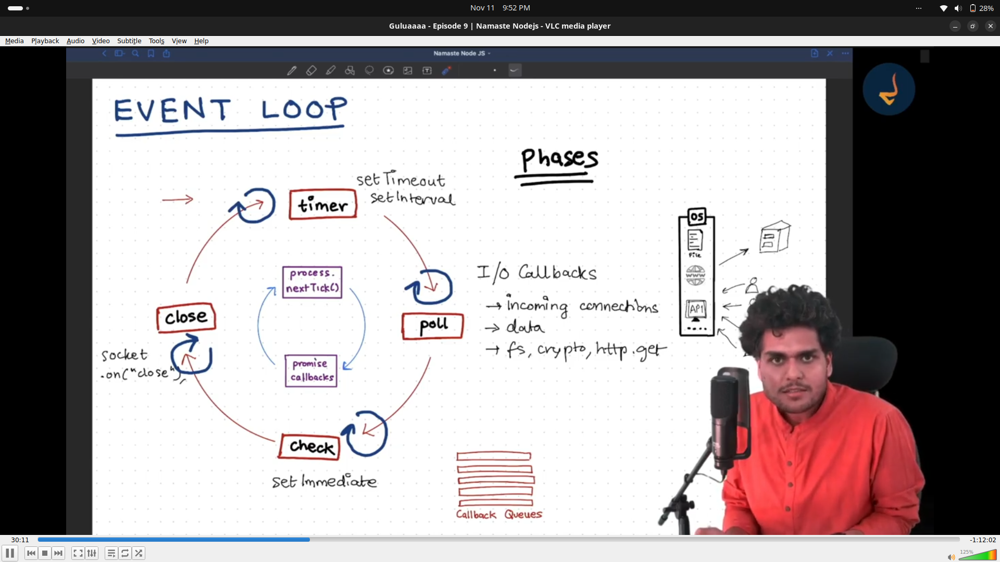

## What is role of Libuv in side the Node.JS ?

- provides asynchronous I/O to node. Node.JS is `non-blocking I/O model` so using libuv this thing is happen.

- normally see JS is synchronous but same API's like file, network, and DNS requests this are asynchronous operation handel by libuv in side node.

- Thread Pool for Blocking Operations: While Node.js is single-threaded, it offloads some blocking operations to a background thread pool, such as file system operations and cryptographic functions. libuv manages this thread pool, ensuring these tasks don't block the main thread. (main thread is V8 engine)

`in last sync keyword's method are block main thread.`

---

---

## see inside Libuv

> **first know one thing V8 Engine not wait any async task, for async task handle Libuv**

- Node inside Libuv

- Event Loop

