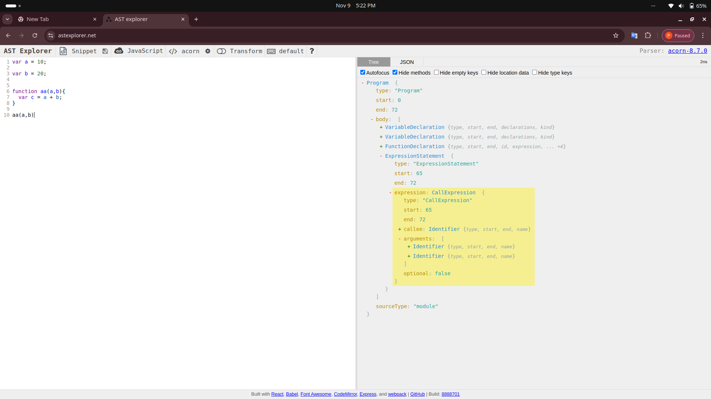

> jab ham JS code ko node me run kar te he tab yah code V8 Engine ke pas jata he or step by step me run hota he, yah steps ham samaj te he.

1. `PARSING`

   - Lexical Analysis / Tokenization

     - yah hamare code ko token me convert kar deta he.

     - ex:- var a = 10; this line ko aa token-1 var, token-2 a, token-3 = and token-4 10 me convert kar deta he.

   - Syntax Analysis / Parsing

     - code ko token me convert kar ne k bad yah token code ka tree me convert kar de ta he. yah tree ko AST(abstract Syntax Tree) kah te he.

     [link of AST site](https://astexplorer.net/)
     

2. `INTERPRETER`

- **JavaScript is an interpreted language with JIT compilation.**

    - now this AST passed inside Interpreter. this V8 Engine Interpreter name is Ignition Interpreter.

    - this Interpreter do AST to convert Byte Code. and find repeated code and give to Turbofan Compiler.

    - after Byte code done Execution is happen.

    - V8 Engine have Turbofan name compiler; it's get repeated code and convert in to optimized machine code.
 