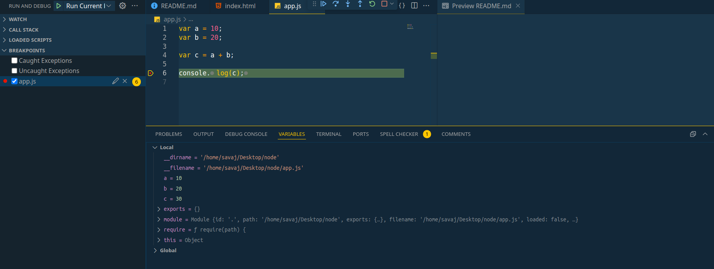

## Diff based on variable scope.

- Node.JS me agar koe code write kar te he to vah code ka scope Local hota he.

- code:-

  

  - in side this image see variable a,b,c are in side local scope and other variable like `__dirname, __filename, exports, module, require` we not declare but it's display.

## this other variable where this come from ?

> Other variables aate he `module wrapper function` se.

- code :-

```JS
(function(exports, require, module, __filename, __dirname) {
    // Code in your module file goes here
})(exports, require, module, __filename, __dirname);
```

normally hamara Node.JS code es function k under rakh kar run hojata he, jiske karan Other variable Local Scope me aa jate he. ( (function{})() se immediately invoked function expressions kah te he, call it's self. )

- ab Node.JS hamara code ko ech module wrapper function ke under dal kar code run kar te he, **to hame Other variable ka access he normal code me bhi.!!**