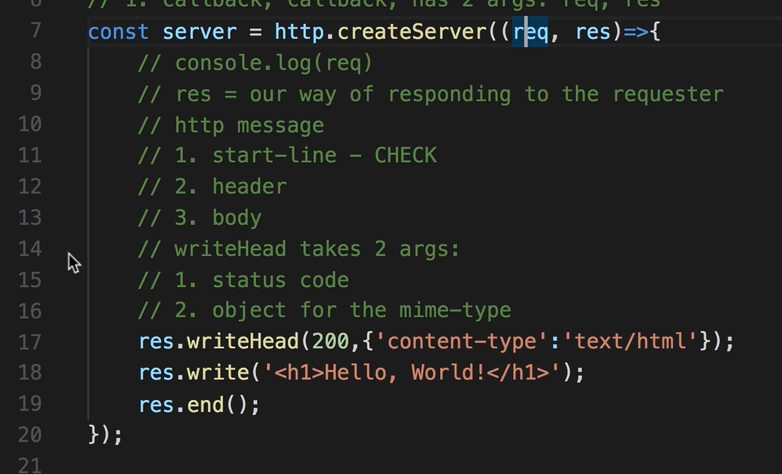
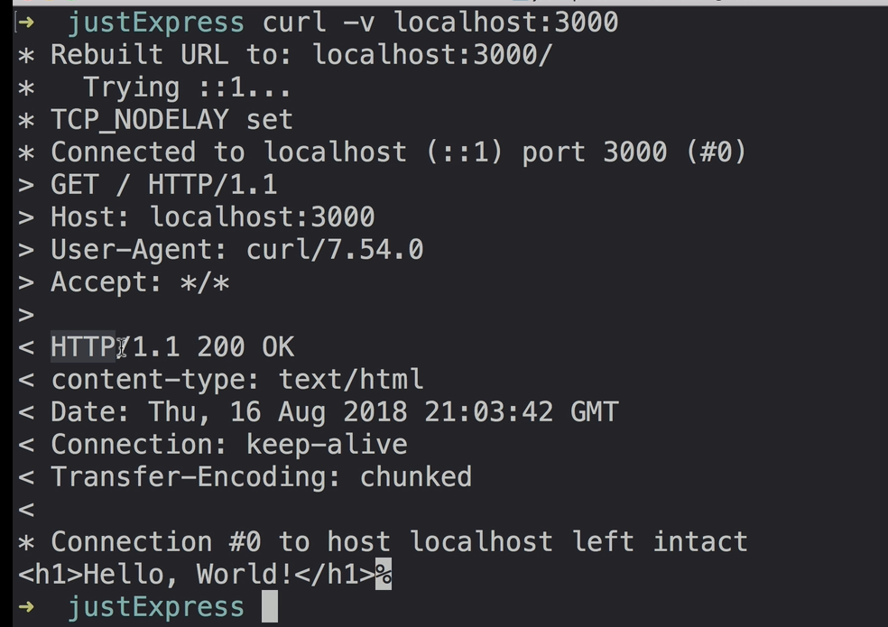
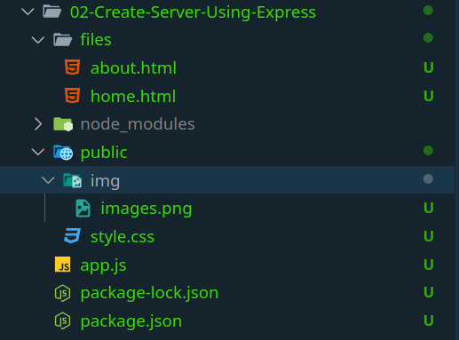

# Section 3

### 6. How the Internet Works - TCP and UDP

`UDP`

- it's faster but not check packet are received successfully or not, only send data,

- used in side video streaming or gaming; here speed is meter not proper data.

- packet ordering is no meter for receiver.

`TCP`

- it's slower than UDP

- three way handshake 1. request for connection 2. receive connection YES or NO. 3. if YES so sand data and receive acknowledgement if any data packet lost resend this packet.

### 7. What is an HTTP request and how does it work?

> after the TCP three way handshake third handshake do using HTTP request.





- first connection between the client and server is ready.

- then HTTP do it's works.

- first client sed http message to server; in side this message have three thing,

  - 1. start line with 1.1 HTTP Method and 1.2 URL to client want 1.3 HTTP version. ex:- `GET https://example.com/profile HTTP/1.1`
  - 2. HTTP Headers (meta data about the request) like Host, User-Agent, Accept, Content-Type...; this Headers are like JS object key and value. ex:- `HOST:www.example.com, ...`
  - 3. Request Body (optional):

- Sending the Request

- Server Processing

- Server send HTTP Response message.

  - 1.1 Status Line
  - 1.2 HTTP Version
  - 1.3 Status Code
    - 200 OK: Successful request.
    - 404 Not Found: Resource doesn’t exist.
    - 500 Internal Server Error: Something went wrong on the server.
  - 2 Response Headers
    - Similar to request headers, these provide metadata about the response.
  - Response Body
    - Contains the actual data, such as an HTML document, image, or JSON data, depending on what was requested.

- Client Receives and Renders.

### 9. Node/HTTP servers 101 & 10. Serving up routes and static files in plain Node (no fun...)

> how to used HTTP core module and create server using this module.

`1. Importing the http Module`

first before used we can import this module.

```JS
const http = require('http');
```

`2. Creating a Basic HTTP Server`

- first create Server using **const server = http.createServer()** method.

  - this method what do and how it's work?
  - http.createServer() method get one callback function.
  - in side this callback function two argument **1 req :** An instance of http.IncomingMessage representing the request. **2 res:** An instance of http.ServerResponse representing the response.
  - Inside the callback, you define the logic for handling requests and constructing responses based on the URL, headers, HTTP method, etc.

```JS
const server = http.createServer((req, res) => {
    res.statusCode = 200;  // Set status code
    res.setHeader('Content-Type', 'text/plain');  // Set headers
    res.end('Hello, World!\n');  // Send response body
});
```

- after creating server we do any location to this server listen. using **server.listen()**
  - using this listen method over server listing on this port of 3000.

```JS
server.listen(3000, () => {
    console.log('Server is running on port 3000');
});
```

`3. Key Classes and Methods in the http Module`

- **http.Server**

  - Represents the HTTP server itself.
  - _server.listen(port, hostname, callback):_ Starts the server on a specified port and hostname.
  - _server.close(callback):_ Stops the server from accepting new connections.

- **http.IncomingMessage**

  - Represents the incoming HTTP request.
  - Available properties:
    - req.method: HTTP method (GET, POST, etc.).
    - req.url: URL path of the request.
    - req.headers: Request headers as an object.
    - req.rawHeaders: Request headers in raw format (array).
    - req.statusCode and req.statusMessage: Status information (for response object).
  - Commonly used to handle request data in smaller chunks using req.on('data', callback) for reading data (especially for POST requests).

- **http.ServerResponse**
  - Represents the outgoing HTTP response.
  - Methods:
    - res.statusCode: Sets the HTTP status code (default is 200).
    - res.setHeader(name, value): Sets a single response header.
    - res.writeHead(statusCode, headers): Sets the status code and headers simultaneously.
    - res.write(data): Sends a chunk of data to the client.
    - res.end([data]): Signals the end of the response.

`4. Handling HTTP Methods and Routing`

- Routing using req.url.

```JS
const server = http.createServer((req, res) => {
    if (req.method === 'GET' && req.url === '/') {
        res.writeHead(200, { 'Content-Type': 'text/plain' });
        res.end('Welcome to the Homepage!');
    } else if (req.method === 'GET' && req.url === '/about') {
        res.writeHead(200, { 'Content-Type': 'text/plain' });
        res.end('About us');
    } else {
        res.writeHead(404, { 'Content-Type': 'text/plain' });
        res.end('Page not found');
    }
});
```

`5. Sending JSON Responses`

```JS
const server = http.createServer((req, res) => {
    if (req.method === 'GET' && req.url === '/data') {
        const data = { message: 'Hello, JSON!' };
        res.writeHead(200, { 'Content-Type': 'application/json' });
        res.end(JSON.stringify(data));
    }
});
```

`6. Handling POST Data`

```JS
const server = http.createServer((req, res) => {
    if (req.method === 'POST' && req.url === '/submit') {
        let body = '';
        req.on('data', chunk => {
            body += chunk.toString();
        });
        req.on('end', () => {
            console.log('Received data:', body);
            res.writeHead(200, { 'Content-Type': 'text/plain' });
            res.end('Data received');
        });
    }
});
```

`7. Making HTTP Requests`

- http.get() Example

```JS
http.get('http://example.com', (res) => {
    let data = '';
    res.on('data', chunk => { data += chunk; });
    res.on('end', () => { console.log(data); });
});
```

- http.request() Example

```JS
const options = {
    hostname: 'example.com',
    port: 80,
    path: '/path',
    method: 'POST',
    headers: { 'Content-Type': 'application/json' }
};

const req = http.request(options, (res) => {
    let data = '';
    res.on('data', chunk => { data += chunk; });
    res.on('end', () => { console.log('Response:', data); });
});

req.write(JSON.stringify({ message: 'Hello, server!' }));
req.end();
```

`8. Error Handling`

```JS
server.on('error', (err) => {
    console.error('Server error:', err);
});
```

### 11 Drawback of http server.

- in side 11 episode so the http sever drawback.

- to see open app.js file.

- handle "/style.css", "/NodeJS_logo.svg" like every request.

---

---

# Section 4

`What is express ?`

- Express.js is a minimal and flexible web application framework for Node.js,

- designed for building web applications and APIs.

- It simplifies the process of creating server-side applications by providing a range of features to handle requests, routes, responses, and middleware.

**Key Features of Express**

1. Routing: Allows you to define URL routes for different HTTP methods (GET, POST, PUT, DELETE) and map them to handler functions.

2. Middleware: Lets you add reusable code between the request and response cycle, such as logging, parsing JSON, handling errors, and authenticating users.

3. Templating: Supports rendering dynamic HTML pages using templating engines like Pug, EJS, or Handlebars.

4. Request and Response Handling: Provides utility functions to handle and manipulate HTTP requests and responses.

5. Extensibility: Express has a modular structure, so you can add features by incorporating third-party middleware or creating custom ones.

`create sever using express !`

```JS
const express = require("express");

const app = express();

// get the url request and send back to demo data.
app.get("*", (req, res) => {
  res.send("<h1>Hello World!</h1>");
});

// server listen on this file argument
app.listen(3000, () => {
  console.log("Server is up on port 3000.");
});
```

`Express server methods`

- this all method get 2 arguments => path and callback function

- any of this method used but and write in side callback res.send so it's not display and only loading screen

1. app.get('/',(req,res)=>{
   res.send("<p>this is get page </p>")
   }) => for reading data

- this is default method of the server

2. app.post() => for create data
3. app.put() => for update data
4. app.delete() => for delete data
5. app.all() => for all method

### 15.

`Serving Static Files in Express`

Syntax:

```JS
app.use(express.static('public'));
```

Explanation:

- express.static('public'): This tells Express to look in the public directory (or whatever directory name you specify) for static files.

- When a request comes in for a static asset (like /style.css), Express will search for this file in the specified directory and serve it if found.

- using this express static public it not log to write every img name of css file name to routes

You can also add multiple express.static() middlewares if you have assets in different folders:

```JS
app.use(express.static('public'));
app.use(express.static('assets'));
```

`send file based on routes`

- for this send file we used path module of node.

```JS
const path = require("node:path");
const app = express();
```

- now handle the static files using express.static method.

```JS
app.use(express.static("public"));

```

- used all method and send Response as file using the sendFile and path.join method.

```JS
app.all("/", (req, res) => {
  res.sendFile(path.join(__dirname, "files", "home.html"));
});

app.all("/about", (req, res) => {
  res.sendFile(path.join(__dirname, "files", "about.html"));
});
```

- show this file structure



---

---

# Section 5

`Middleware and Rendering`

> Note: before start this section first understand method of express to create confutation

1. use()

   - .use() method is used to add middleware functions to your application.
   - now see what is Middleware and what used of that.
   - `middleware` refers to functions that execute during the request-response cycle.
   - Middleware functions have access to the req (request) and res (response) objects and can modify them, handle requests, or pass them on to other middleware functions.
   - ```JS
     function (req, res, next) { }
     ```
   - `req:` The request object.
     `res:` The response object.
     `next:` A function that passes control to the next middleware function. If next() is not called, the request will be left hanging and won't proceed to the next middleware or route.
   - EX:-

   ```JS
   app.use((req, res, next) => {
    console.log('Request received');
    next();
   });
   ```

   - The example above will log every request to the console.

   - **It can be used to serve static files, like CSS or JavaScript.**

   - **Path-specific Middleware:** You can also specify a path so that it only applies to routes starting with /api, for example:

   ```JS
     app.use('/api', (req, res, next) => {
     console.log('API request received');
     next();
     });
   ```

> **Middleware create using app.use(), and it's call every http request.**

2. app.all()

   - Sets up a route handler that will run for all HTTP methods (GET, POST, PUT, DELETE, etc.) on a specific path. Unlike app.use(), app.all() is route-specific, meaning it targets a specific URL or route.

> main used for the what ever the data get form the Middleware function it's used in side the Rendering method like all(), get(), post() etc...

ex:-

```JS
const express = require("express");

const app = express();
app.use((req, res, next) => {
  res.locals.a = 10;
  console.log("use call");
  next();
});

app.get("/", (req, res) => {
  res.send("<h1>ok G</h1>");
  console.log("get method call");
  console.log(res.locals.a);
});

app.listen(3000, () => {
  console.log("run on 3000");
});
```

`List out upto do method of express`

- create application.

  const app = express()

- listen server.

  app.listen()

- router

  app.all(),
  app.get(),
  app.post(),
  app.delete(),
  app.METHOD(),
  app.put(),

- serves static file, his is a built-in middleware function.

  express.static()

- middleware

  app.use(), 
  express.json(),
```JS
POST /api/endpoint HTTP/1.1
Host: example.com
Content-Type: application/json

{
  "key1": "value1",
  "key2": "value2"
}
```
  express.urlencoded(),

```JS
POST /api HTTP/1.1
Content-Type: application/x-www-form-urlencoded

key1=value1&key2=value2
```

  helmet -> 3rd party module ** any one can not change the harder of the responds data.

- request

  req.ip -> requester ip address;
  req.path -> requester path;
  req.body -> using middleware stored any data inside this req.body;

- response

  res.send() -> send any data or res.send(.end()) for not more any thing to send; 
  res.sendFile() -> sending file; 
  res.locals -> when middleware do any data to set in side this object and access on and rout; 
  res.json -> send to json data.

`21. Wiring up Express with a view engine`

in side the 04-Rendering


keep going on 06-section ...